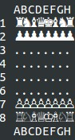

HaskellProject
==============
Chess Game
----------

My project to **67452 FUNCTIONAL PROGRAMMING: HASKELL** course at **Hebrew University of Jerusalem**

This will work only on Linux [*]_ , but I may add support in the future for Windows as well.

To run the game just enter ghci and:
::
  Preload> :load Chess.hs
  Preload> main

To run this chess game using Docker, follow these steps:
::
  docker build -t haskell-chess .
  docker run -it haskell-chess

You'll understand how to play while playing.

Have FUN!!

.. [*] Due to special terminal functionality and unicode symbols

:Author: 
    Aviad Levy

:Version: 1.0
